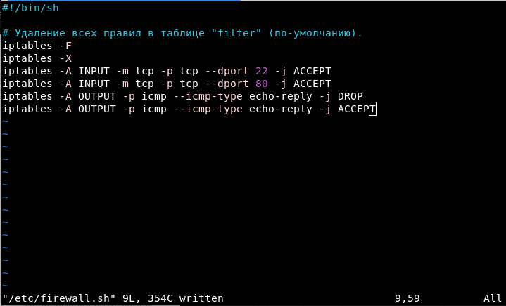
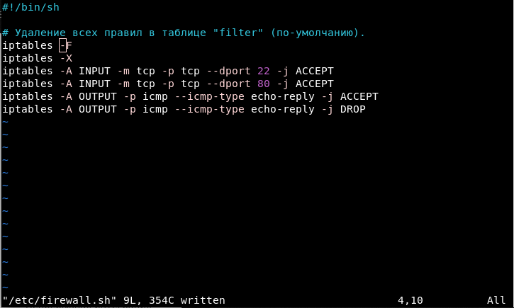

# Сети в Linux

## нструмент ipcalc
---
- **1.1. Сети и маски**:
- 1) Адрес сети 192.167.38.54/13: 
- С помощью команды `ipcalc 192.167.38.54/13` определим адрес сети:
- 
- Адрес сети: 192.160.0.0
- 2) Перевод маски 255.255.255.0 в префиксную и двоичную запись: /24, 11111111.11111111.11111111.00000000
- Перевод маски /15 в обычную и двоичную запись: 255.254.0.0, 11111111.1111111 0.00000000.00000000
- Перевод маски 11111111.11111111.11111111.1111 0000 в обычную и префиксную: 255.255.255.240, /28
- **1.2. localhost**:
- Для приложений, работающих на localhost, выделяют следующий диапазон IP-адресов, через которых к ним можно обратиться: 127.0.0.1 - 127.255.255.254. Так что из перечсленны IP-адресов: 194.34.23.100*, *127.0.0.2*, *127.1.0.1*, *128.0.0.1*, подходят только *127.0.0.2* и *127.1.0.1*
- **1.3. Диапазоны и сегменты сетей**:
- 1) Из перечисленных IP-адресов: *10.0.0.45*, *134.43.0.2*, *192.168.4.2*, *172.20.250.4*, *172.0.2.1*, *192.172.0.1*, *172.68.0.2*, *172.16.255.255*, *10.10.10.10*, *192.169.168.1*
- В качестве частных можно использовать: *10.0.0.45*, *192.168.4.2*, *172.20.250.4*, *172.16.255.255*, *10.10.10.10*
- В качестве публичных можно использовать: *134.43.0.2*, *172.0.2.1*, *192.172.0.1*, *172.68.0.2*, *192.169.168.1*
- 2) Для сети 10.10.0.0/18* HostMin: 10.10.0.1, HostMax: 10.10.63.254. Для нее возможно следующие IP-адреса: *10.0.0.1*, *10.10.0.2*, *10.10.10.10*
---
## татическая маршрутизация между двумя машинами
---
- Результат работы команды `ip a` для обеих машин:
- Для ws-1:
- 
- Для ws-2:
- 
\> *Сетевой интерфейс - программное обеспечение, взаимодействующее с сетевым драйвером и с уровнем IP. Сетевой интерфейс обеспичивает уровню IP доступ ко всем имеющим сетевым адаптерам*
- Добавим для каждой машины по сетевому интерфейсу для работы с внтутренней сетью, через virtualBox.
- Проверим наличие нового сетевого интерфейса для ws-1 при помощи команды `ip a`:
- 
- Проверим наличие нового сетевого интерфейса для ws-2 при помощи команды `ip a`:
- 
- В данном случае для обеих машин это интерфейс enp0s8.
- Зададим соответствующие адреса и маски для машин ws-1 и ws-2 - *192.168.100.10*, маска */16*, ws2 - *172.24.116.8*, маска */12*:
- для ws-1:
- Отредактируем файл */etc/netplan/00-installer-config.yaml*
- 
- Перезапустим сервис сети с помощью команды `netplan apply`
- 
- С помощью команды `ip r` увидим изменения:
- 
- для ws-2:
- Отредактируем файл */etc/netplan/00-installer-config.yaml*
- 
- Перезапустим сервис сети с помощью команды `netplan apply`
- 
- С помощью команды `ip r` увидим изменения:
- 
- **2.1. Добавление статического маршрута вручную:**
- При добавлении интерфейса для внутренней сети выше для обеих виртуальных машин необходимо было в настройках обеих назвать внутреннюю сеть одинакого. 
- Добавим путь от машины ws-1 к ws-2 с помощью команды `sudo ip r add "IP-адрес сети" dev "название интерфейса"`:
- для ws-1:
- 
- для ws-2:
- 
- **2.2. Добавление статического маршрута с сохранением:**
- После перезагрузки машин добавим статический маршрут от одной до другой с помощью файла */etc/netplan/00-installer-config.yaml*:
- для ws-1:
- 
- для ws-2:
- 
- Пропингуем соединение между машинами:
- от ws-1 к ws-2:
- 
- от ws-2 к ws-1:
- 
---
## тилита **iperf3**
---
- **3.1. Скорость соединения:**
- Переведем следующие величины:
- 8 Mbps = 1 MB/s
- 100 MB/s = 800000 Kbps
- 1 Gbps = 1000 Mbps
- **3.2. Утилита **iperf3:**
- Измерим скорость соединения между ws-1 и ws-2:
- Для этого воспользуемся утилитовй **iperf3**:
- Для начала установим на обе машины программу с помощью команды `sudo apt install iperf3`.
- После зайдем на ws-2 (в данный момент она будет выступать сервером) и запустим серверную часть программы с помощью команды `iperf3 -s -f M`:
- 
- Далее переключимся на машину ws-1 (в данный момент она будет выступать клиентом) и запусит клиентскую часть программы `iperf3 -c 172.24.116.8 -f M`:
- 
- Далее сделаем то же самое, только поменяем роли для машин:
- Зайдем на ws-1 (в данный момент она будет выступать сервером) и запустим серверную часть программы с помощью команды `iperf3 -s -f M`:
- 
- Далее переключимся на машину ws-2 (в данный момент она будет выступать клиентом) и запусит клиентскую часть программы `iperf3 -c 192.168.100.10 -f M`:
- 
---
## етевой экран
---
- **4.1. Утилита iptables:**
- Создадим файл */etc/firewall.sh*, имитирующий фаерволл, на ws1 и ws2:
- Запишим привила для машины ws-1:
- 
- Запишем правила для машины ws-2:
- 
- Дадим файлам */etc/firewall.sh* на обеих машинах соответсвтующие права для исполнения:
- для ws-1 с помощью команды `sudo chmod +x /etc/firewall.sh`:
- 
- для ws-2 с помощью команды `sudo chmod +x /etc/firewall.sh`:
- 
- Запустим файлы для обеих машин с помощью команды `sudo /etc/firewall.sh`:
- для ws-1 и проверим, что правила применились:
- 
- для ws-2:
- 
- Разница между содержимым 2-х файлов: Для машины ws-1 сперва происходит запрет на отправку пакетов, а только потом разрешение. Для машины ws-2 сперва прописано разрешение, а потом только запрет на отправку пакетов. Как только пакет, проходя по всем цепочкам, встречает правило, на разрешение дальнейщего пути, все следующие правила отбрасываются, и пакет отправляется. Т.е. для ws-2 пакет не получает информацию о том, что ему запрещено отправляться, в отличие от пакета на ws-1.
- **4.2. Утилита nmap**
- Попытка пропинговать с машины ws-1 машину ws-2:
- 
- Попытка пропинговать с машины ws-2 машину ws-1:
- 
- Машины ws-1 не пингуется.
- С помощью команды `nmap 192.168.100.10`, находясь на ws-2, проверим, запущен ли host машины ws-1:
- 
- Сделаем дамп ws-1:
- 
- Сделаем дамп ws-2:
- 
---
## татическая маршрутизация сети
---
- Поднимим 5 виртуальных машин и назовем их ws-11, ws-21, ws-22, r-1, r-2.
- **5.1. Настройка адресов машин**
- Настроил конфигурации машин в *etc/netplan/00-installer-config.yaml* согласно сети на рисунке.
    - Настройки конфигурации сети машины ws11
        - 
    - Настройки конфигурации сети машины ws21
        - 
    - Настройки конфигурации сети машины ws22
        - 
    - Настройки конфигурации сети машины r1
        - 
    - Настройки конфигурации сети машины r2
        - 
- Перезапустить сервис сети. Если ошибок нет, то командой `ip -4 a` проверить, что адрес машины задан верно. Также пропинговать ws22 с ws21. Аналогично пропинговать r1 с ws11.
    - вывод команд ws11
        - 
    - вывод команд ws21, а так же пинг машины ws22
        - 
    - вывод команд ws22
        - 
    - вывод команд r1, а так же пинг машины ws11
        - 
    - вывод команд r2
        - 
- **5.2. Включение переадресации IP-адресов.**
- Для включения переадресации IP, выполните команду на роутерах: `sysctl -w net.ipv4.ip_forward=1`
    - вывод команды r1
        - 
    - вывод команды r2
        - 
- Откройте файл */etc/sysctl.conf* и добавьте в него следующую строку: `net.ipv4.ip_forward = 1`
    - конфигурация файла /etc/sysctl.conf для r1
        - 
    - конфигурация файла /etc/sysctl.conf для r2
        - 
- **5.3. Установка маршрута по-умолчанию**
- Настроить маршрут по-умолчанию (шлюз) для рабочих станций. Для этого добавить gateway4 \[ip роутера\] в файле конфигураций
    - Настройки конфигурации сети машины ws11
        - 
    - Настройки конфигурации сети машины ws21
        - 
    - Настройки конфигурации сети машины ws22
        - 
- Вызвать `ip r` и показать, что добавился маршрут в таблицу маршрутизации
    - вывод команды `ip r` ws11
        - 
    - вывод команды `ip r` ws22
        - 
    - вывод команды `ip r` ws21
        - 
- Пропинговать с ws11 роутер r2 и показать на r2, что пинг доходит. Для этого использовать команду: `tcpdump -tn -i enp0s9`
    - использование команды `ping` c машины ws11
        - 
    - использование команды `tcpdump -tn -i enp0s9` c машины r2
        - 
- **5.4. Добавление статических маршрутов**
- Добавить в роутеры r1 и r2 статические маршруты в файле конфигураций.
    - конфигурация файла `etc/netplan/00-installer-config.yaml` для r1
        - 
    - конфигурация файла `etc/netplan/00-installer-config.yaml` для r2
        - 
- Вызвать `ip r` и показать таблицы с маршрутами на обоих роутерах.
    - вывод команды r1
        - 
    - вывод команды r2
        - 
- Запустить команды на ws11: `ip r list 10.10.0.0/18` и `ip r list 0.0.0.0/0`
    - 
- Адрес 0.0.0.0/0 используется в случае если не указан конкретный адрес получателя либо это означает, что в таблице маршрутизации не указан конкретный адрес в качестве следующего перехода на пути пакета к его конечному получателю. В наше же случает для ws11 адрес 10.10.0.0/18 является его сетью и мы можем к нему обратиться напрямую так они находяться в одной сети
- **5.5. Построение списка маршрутизаторов**
- Запустить на r1 команду дампа: `tcpdump -tnv -i enp0s8`. При помощи утилиты **traceroute** построить список маршрутизаторов на пути от ws11 до ws21
    - запуск команды `traceroute` с машины ws11 до машины ws21
        - 
    - запуск команды `tcpdump -tnv -i enp0s8` с машины r1
        - 
    - Команда traceroute linux использует UDP пакеты. Она отправляет пакет с TTL=1 и смотрит адрес ответившего узла, дальше TTL=2, TTL=3 и так пока не достигнет цели. Каждый раз отправляется по три пакета и для каждого из них измеряется время прохождения. Пакет отправляется на случайный порт, который, скорее всего, не занят, что мы и видим при вызове команды `tcpdump -tnv -i enp0s8`. Пакеты отправляются на разные порты до тех пор пока не попадет на нужный.
- **5.6. Использование протокола **ICMP** при маршрутизации**
- Запустить на r1 перехват сетевого трафика, проходящего через eth0 с помощью команды: `tcpdump -n -i enp0s8 icmp`
    - 
- Пропинговать с ws11 несуществующий IP (например, *10.30.0.111*) с помощью команды: `ping -c 1 10.30.0.110`
    - 
---
## Part 6. Динамическая настройка IP с помощью **DHCP**
- Для r2 настроить в файле */etc/dhcp/dhcpd.conf* конфигурацию службы **DHCP**:
- Установим на r2 dhcp server командой `sudo apt install isc-dhcp-server`
    1. указать адрес маршрутизатора по-умолчанию, DNS-сервер и адрес внутренней сети.
    - 
        - необходимо изменить файл `/etc/default/isc-dhcp-server` добавить имя сетевой карты через которую будем выдавать IP адресс
        - 
    2. в файле *resolv.conf* прописать `nameserver 8.8.8.8.`
    - 
- Перезагрузить службу **DHCP** командой `systemctl restart isc-dhcp-server`, предварительно в файле `etc/netplan/00-installer-config.yaml` разрешить выдачу файлов по dhcp4. Машину ws21 перезагрузить при помощи `reboot` и через `ip a` показать, что она получила адрес. Также пропинговать ws22 с ws21.
    - в файле `etc/netplan/00-installer-config.yaml` разрешить выдачу файлов по dhcp4
        - 
    - использование команды `ip a` и пинг машины w22
        - 
- Указать MAC адрес у ws11, для этого в *etc/netplan/00-installer-config.yaml* надо добавить строки: `macaddress: 10:10:10:10:10:BA`, `dhcp4: true`
    - 
- Для r1 настроить аналогично r2, но сделать выдачу адресов с жесткой привязкой к MAC-адресу (ws11). Провести аналогичные тесты
    1. указать адрес маршрутизатора по-умолчанию, DNS-сервер и адрес внутренней сети.
    - 
        - необходимо изменить файл `/etc/default/isc-dhcp-server` добавить имя сетевой карты через которую будем выдавать IP адресс
        - 
    2. в файле *resolv.conf* прописать `nameserver 8.8.8.8.`
    - 
- Перезагрузить службу **DHCP** командой `systemctl restart isc-dhcp-server`, предварительно в файле `etc/netplan/00-installer-config.yaml` разрешить выдачу файлов по dhcp4. Машину ws11 перезагрузить при помощи `reboot` и через `ip a` показать, что она получила адрес. Также пропинговать ws22 с ws11.
    - использование команды `ip a` и пинг машины ws22
        - 
- Запросить с ws21 обновление ip адреса c использованием команд `sudo dhclient -r enp0s8` для освобождения ip адреса и `sudo dhclient enp0s8` для обновления ip адреса
    - 
    - 
---
## Part 7. **NAT**
---
- В файле */etc/apache2/ports.conf* на ws22 и r1 изменить строку `Listen 80` на `Listen 0.0.0.0:80`, то есть сделать сервер Apache2 общедоступным. Установим apache2 на машинах ws22 и r1 командой `sudo apt install apache2`.
    - `/etc/apache2/ports.conf` для ws22
        - 
    - `/etc/apache2/ports.conf` для r1
        - 
- Добавить в фаервол, созданный по аналогии с фаерволом из Части 4, на r2 следующие правила:
1. Удаление правил в таблице filter - `iptables -F`
2. Удаление правил в таблице "NAT" - `iptables -F -t nat`
3. Отбрасывать все маршрутизируемые пакеты - `iptables --policy . --policy FORWARD DROP` 
- Конфигурация скрипта `/etc/firewall` на r2:
    - 
- Проверить соединение между ws22 и r1 командой `ping`
*При запуске файла с этими правилами, ws22 не должна "пинговаться" с r1*
    - 
- Добавить в файл ещё одно правило:
4. Разрешить маршрутизацию всех пакетов протокола **ICMP**
    - 
- Проверить соединение между ws22 и r1 командой `ping`
    - 
- Добавить в файл ещё два правила:
5. Включить **SNAT**, а именно маскирование всех локальных ip из локальной сети, находящейся за r2 (по обозначениям из Части 5 - сеть 10.20.0.0)
6. Включить **DNAT** на 8080 порт машины r2 и добавить к веб-серверу Apache, запущенному на ws22, доступ извне сети. *Перед тестированием отключим сетевой интерфейс **NAT** (его наличие можно проверить командой `ip a`) в VirtualBox, если он включен*
    - 
    - 
    - 
    - 
- Проверить соединение по TCP для **SNAT**, для этого с ws22 подключиться к серверу Apache на r1 командой: `telnet [адрес] [порт]`
    - 
- Проверить соединение по TCP для **DNAT**, для этого с r1 подключиться к серверу Apache на ws22 командой `telnet` (обращаться по адресу r2 и порту 8080)
    - 
---
## Part 8. Дополнительно. Знакомство с **SSH Tunnels**
---
Запустить на r2 фаервол с правилами из Части 7
- Запустить на r2 фаервол с правилами из Части 7
    - 
- Запустить веб-сервер **Apache** на ws22 только на localhost (то есть в файле */etc/apache2/ports.conf* изменить строку `Listen 80` на `Listen localhost:80`
    - 
- Воспользоваться *Local TCP forwarding* с ws21 до ws22, чтобы получить доступ к веб-серверу на ws22 с ws21
    - для этого в файле `/etc/ssh/sshd_config` нужно раскомментировать строчку `AllowTcpForwarding yes` на машине ws22 и ws21
        - 
    - далее используя Local tcp forwarding подключаемся к машине ws22 с машины ws21 командой `ssh -L 32686:localhost:80 10.20.0.20` используя локальный порт `32686`
        - 
    - создаем второй терминал комбинацией клавиш `Alt + F2` и и выполняем команду: `telnet 127.0.0.1 [локальный порт]`
        - 
- Воспользоваться *Remote TCP forwarding* c ws11 до ws22, чтобы получить доступ к веб-серверу на ws22 с ws11
    - для этого в файле `/etc/ssh/sshd_config` нужно раскомментировать строчку `AllowTcpForwarding yes` на машине ws11
        - 
    - для этого в файле `/etc/ssh/sshd_config` нужно раскомментировать строчку `AllowTcpForwarding yes` и строчку `AllowAgentForwarding yes` на машине ws11
        - 
    - далее используя Local tcp forwarding подключаемся к машине ws22 с машины ws11 cерией команд:
        - `ssh -L 8080:localhost:8080 10.10.0.1` используя локальный порт `8080` идет подключение по ssh с машины ws11 на r1
            - 
        - `ssh -L 8080:localhost:8080 10.20.0.1` используя локальный порт `8080` идет подключение по ssh с машины r1 на r2
            - 
        - `ssh -L 8080:localhost:80 10.20.0.20` используя локальный порт `8080` идет подключение по ssh с машины r2 на ws22 к localhost:80 тоесть на сервер
            - 
    - создаем второй терминал комбинацией клавиш `Alt + F2` и и выполняем команду: `telnet 127.0.0.1 [локальный порт]`
        - 
    - 2 cпособ. Необходимо с машины ws22 подключиться к ws11 к любому свободному порту чтобы заставить его слушать этот порт, затем с машины ws11 устанавливаем соединение с ws22 прослушивая тот же свободный порт и получаем доступ к `localhost:80`:
        - `ssh -R 36000:localhost:80 10.20.0.20` используя локальный порт `36000` идет подключение по ssh с машины ws11 на ws22
            - 
        - Так же необходимо подключиться с машины ws22 на ws11 `ssh -R 36000:localhost:80 10.10.0.20` используя локальный порт `36000` идет подключение по ssh с машины ws22 на ws11
            - 
        - создаем второй терминал комбинацией клавиш `Alt + F2` и и выполняем команду: `telnet 127.0.0.1 [локальный порт]`
            - 